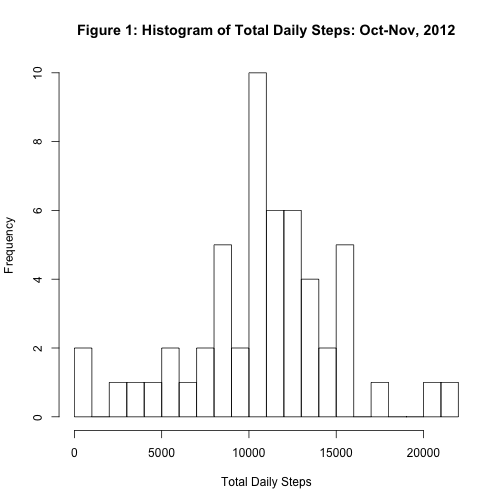
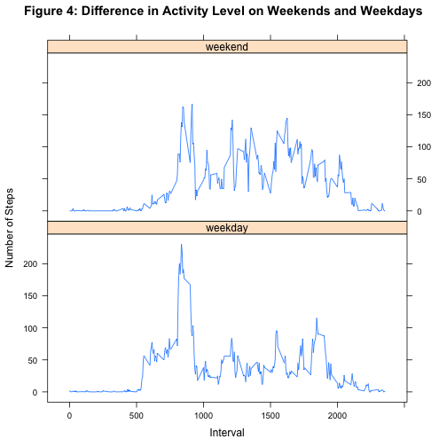

set---
title: "Reproducible Research: Peer Assessment 1"
output: 
  html_document:
    keep_md: true
---


It is now possible to collect a large amount of data about personal
movement using activity monitoring devices such as a
[Fitbit](http://www.fitbit.com), [Nike
Fuelband](http://www.nike.com/us/en_us/c/nikeplus-fuelband), or
[Jawbone Up](https://jawbone.com/up). These type of devices are part of
the "quantified self" movement -- a group of enthusiasts who take
measurements about themselves regularly to improve their health, to
find patterns in their behavior, or because they are tech geeks. But
these data remain under-utilized both because the raw data are hard to
obtain and there is a lack of statistical methods and software for
processing and interpreting the data.

This assignment makes use of data from a personal activity monitoring
device. This device collects data at 5 minute intervals through out the
day. The data consists of two months of data from an anonymous
individual collected during the months of October and November, 2012
and include the number of steps taken in 5 minute intervals each day.


The data for this assignment can be downloaded from the course web
site:

* Dataset: [Activity monitoring data](https://d396qusza40orc.cloudfront.net/repdata%2Fdata%2Factivity.zip) [52K]

The variables included in this dataset are:

* **steps**: Number of steps taking in a 5-minute interval (missing
    values are coded as `NA`)

* **date**: The date on which the measurement was taken in YYYY-MM-DD
    format

* **interval**: Identifier for the 5-minute interval in which
    measurement was taken

The dataset is stored in a comma-separated-value (CSV) file and there
are a total of 17,568 observations in this
dataset.

## Loading and preprocessing the data

The step data provided for this project was already in a tidy dataset.  The only pre-processing involved unzipping the file and changing the date variable to a Date type.


```r
unzip("activity.zip")
activity <- read.csv("activity.csv")
activity$date <- as.Date(activity$date)
```


## What is mean total number of steps taken per day?

After removing all intervals with missing data for steps, the data was aggregated to find a total number of steps for each day of the study.


```r
steps_no_na <- activity[!is.na(activity$steps),]
steps_by_date <- aggregate(list(steps = steps_no_na$steps), list(date = steps_no_na$date), sum)
hist(steps_by_date$steps, breaks = 30,
      main = "Figure 1: Histogram of Total Daily Steps: Oct-Nov, 2012",
      xlab = "Total Daily Steps")
```

 

```r
mean_by_date <- round(mean(steps_by_date$steps),2)
median_by_date <- median(steps_by_date$steps)
```

Looking at a histogram of the daily steps, the variable seems to be fairly normally distributed with a mean of 10766.19 and a median of 10765.


## What is the average daily activity pattern?

To look at the average daily activity pattern, the data was aggregated across intervals to get the average number of steps the volunteer took during an given interval across all days of the study.


```r
steps_by_interval <- aggregate(list(steps = steps_no_na$steps), list(interval = steps_no_na$interval), mean)
plot(steps_by_interval$interval,steps_by_interval$steps, type ="l",
      main = "Figure 2: Average Number of Steps for Each Time Interval",
      xlab = "Time Interval",
      ylab = "Average Number of Steps")
```

 

```r
max_steps <- round(max(steps_by_interval$steps),2)
max_interval <- steps_by_interval[which.max(steps_by_interval$steps),1]
max_interval_hour <- round(max_interval/100,0)
max_interval_minute <- round(max_interval%%100,0)
```

The maximum average number of steps, 206.17, occurred during interval number 835 which begins at 8:35.

## Imputing missing values

In the above analyses, the intervals with missing data were removed.  For this analysis, instead of being removed, missing values for steps were imputed to be the average number of steps for that interval over the two months (already calculated for Figure 2 above.)

```r
total_missing <- sum(is.na(activity$steps))
imp_steps <- activity
for (i in 1:nrow(imp_steps)) {
      if (is.na(imp_steps$steps[i])){
            time_interval = imp_steps$interval[i]
            imp_steps$steps[i] = steps_by_interval[steps_by_interval$interval==time_interval,2]
      }
}

imp_steps_by_date <- aggregate(list(steps = imp_steps$steps), list(date = imp_steps$date), sum)
hist(imp_steps_by_date$steps, breaks = 30,
      main = "Figure 3: Histogram of Total Daily Steps: Oct-Nov, 2012",
      sub = "(missing data replaced with average for interval)",
      xlab = "Total Daily Steps")
```

 

```r
imp_mean_by_date <- round(mean(imp_steps_by_date$steps),2)
imp_median_by_date <- round(median(imp_steps_by_date$steps),2)
```

A total of 2304 intervals had missing data and were replaced with averages.  In this new dataset, the mean is 10766.19 and the median is 10766.19.  The mean does not change at all, which is not surprising given the missing intervals were replaced with means, and the median changes very little.  

## Are there differences in activity patterns between weekdays and weekends?

To discover if there is a difference in actvity between weekdays and weekends, I created a new variable by finding the day of the week from the date and then a factor variable that designated that day as "weekend" or "weekday."  Then the data was aggregated by type of day and interval to get an average for each interval separately for weekdays and weekends.

```r
imp_steps$day <- weekdays(imp_steps$date)
imp_steps$weekday <- as.factor(with(imp_steps, ifelse(day == "Saturday" | day == "Sunday", "weekend","weekday")))
steps_by_weekday <- aggregate(list(steps = imp_steps$steps), list(interval = imp_steps$interval, weekday = imp_steps$weekday), mean)
library(lattice)
xyplot(steps ~ interval | weekday, data= steps_by_weekday, type = "l", layout = c(1,2),
       main = "Figure 4: Difference in Activity Level on Weekends and Weekdays",
       xlab = "Interval", ylab = "Number of Steps")
```

 

The plot suggests that the volunteer is active earlier in the day on weekdays and seems to sleep later on weekend mornings.  The volunteer also seems to be active later in the evening on weekends.  The volunteer is active more throughout the day on weekends, but on both weekends and weekdays there is a broad peak in the mid-morning.

